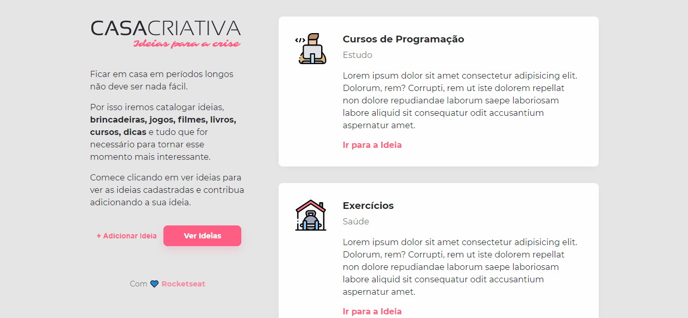

<h1 align="center">
    
</h1>

---

<h1>
    
</h1>

## 📝 Sobre
Projeto desenvolvido em meio a pandemia do coronavírus. Este curso foi disponibilizado pela **Rocketseat**.

---

## :rocket: Tecnologias utilizadas

O projeto foi desenvolvido utilizando as seguintes tecnologias:

- [HTML5](https://developer.mozilla.org/pt-BR/docs/Web/HTML/HTML5)
- [CSS3](https://developer.mozilla.org/pt-BR/docs/Archive/CSS3)
- [JavaScript](https://www.javascript.com/)

---

Desenvolvido com 💙 por Bruno Corrêa
